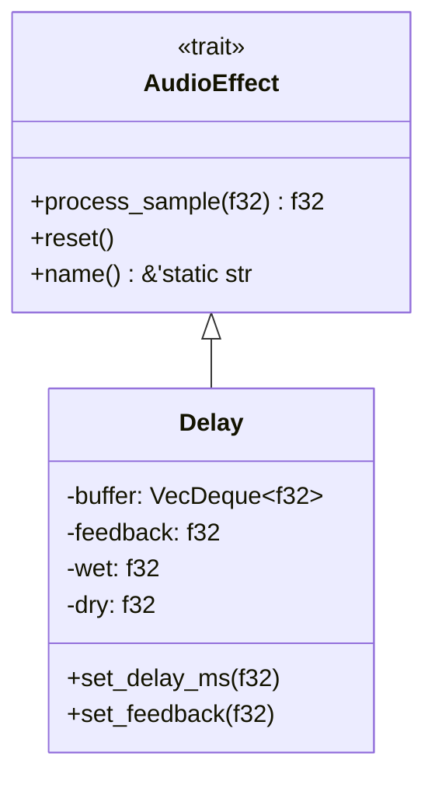

# Documentación Técnica de ClearCast Core

## Índice
1. [Arquitectura del Núcleo](#arquitectura-del-núcleo)
2. [Modelo de Procesamiento](#modelo-de-procesamiento)
3. [Sistema de Efectos](#sistema-de-efectos-detallado)
4. [Manejo de Memoria](#manejo-de-memoria)
5. [Concurrencia](#concurrencia)
6. [Optimizaciones](#optimizaciones)
7. [API Pública](#api-pública)

## Arquitectura del Núcleo

### Visión General
El núcleo de ClearCast está diseñado siguiendo principios de:
- **Bajo acoplamiento**: Módulos independientes con interfaces bien definidas
- **Alta cohesión**: Cada componente tiene una responsabilidad única
- **Extensibilidad**: Fácil de ampliar con nuevos efectos y procesadores

### Componentes Principales

#### 1. AudioEngine
Gestiona el ciclo de vida del procesamiento de audio:
```rust
impl AudioEngine {
    pub fn new() -> Self { /* ... */ }
    pub fn process(&self, input: Vec<f32>) -> Result<Vec<f32>, AudioError> { /* ... */ }
    pub fn add_effect(&mut self, effect: Arc<Mutex<dyn AudioEffect>>) { /* ... */ }
}
```

#### 2. Pipeline de Procesamiento
1. **Pre-procesamiento**:
   - Conversión de formato si es necesario
   - División en buffers manejables

2. **Procesamiento por Etapas**:
   - Reducción de ruido
   - Normalización
   - Aplicación de efectos
   - Limitación de picos

3. **Post-procesamiento**:
   - Conversión de formato de salida
   - Manejo de errores

## Modelo de Procesamiento

### Flujo de Datos


### Manejo de Buffer
- Tamaño de buffer óptimo para rendimiento
- Procesamiento por bloques para reducir latencia
- Reutilización de memoria cuando es posible

## Sistema de Efectos Detallado

### Arquitectura de Efectos


### Implementación de Delay
El efecto de delay implementa un buffer circular con las siguientes características:
- Interpolación para cambios suaves de tiempo
- Control independiente de señales húmeda/seca
- Retroalimentación configurable

## Manejo de Memoria

### Estrategias Clave
1. **Alocación Minimizada**:
   - Reutilización de buffers
   - Uso de tipos de tamaño fijo cuando es posible

2. **Seguridad**:
   - Verificación de límites
   - Manejo seguro de punteros en FFI

3. **Rendimiento**:
   - Alineación de memoria para SIMD
   - Acceso secuencial a memoria

## Concurrencia

### Modelo de Hilos
- Procesamiento por bloques en paralelo
- Bloqueos finos para sincronización
- Canales para comunicación entre hilos

### Seguridad
- Verificación en tiempo de compilación con el sistema de tipos de Rust
- Mutex para acceso compartido
- Arc para conteo de referencias atómico

## Optimizaciones

### Nivel de Compilación
- Habilitación de optimizaciones específicas de CPU
- Uso de SIMD cuando está disponible
- Inlineación de funciones críticas

### Algoritmos
- Procesamiento por lotes
- Cálculos vectorizados
- Lookup tables para operaciones costosas

## API Pública

### Estructuras Principales
```rust
/// Configuración del motor de audio
pub struct AudioConfig {
    pub sample_rate: u32,
    pub buffer_size: usize,
    pub num_channels: u8,
}

/// Error principal de procesamiento
#[derive(Debug, Error)]
pub enum AudioError {
    #[error("Error de formato de audio")]
    FormatError,
    #[error("Error de procesamiento: {0}")]
    ProcessingError(String),
    // ...
}
```

### Uso Típico
```rust
let config = AudioConfig {
    sample_rate: 44100,
    buffer_size: 1024,
    num_channels: 2,
};

let mut engine = AudioEngine::new(config);
let delay = Arc::new(Mutex::new(Delay::new(300.0, 0.5, 0.3, 0.7, 44100)));
engine.add_effect(delay);

let processed = engine.process(input_audio)?;
```

## Consideraciones de Rendimiento

### Métricas Clave
- **Latencia**: Objetivo <10ms
- **Uso de CPU**: <5% en dispositivos modernos
- **Memoria**: Uso predecible y acotado

### Herramientas de Perfilado
- `perf` para análisis de rendimiento
- `heaptrack` para análisis de memoria
- Criterion.rs para benchmarks

## Próximos Pasos

### Mejoras Planeadas
1. Soporte para más formatos de audio
2. Efectos adicionales (reverb, chorus, etc.)
3. Interfaz de usuario mejorada
4. Soporte para procesamiento en tiempo real

## Contribución

### Estándares de Código
- Formato con `rustfmt`
- Verificación con `clippy`
- Documentación exhaustiva

### Proceso de Revisión
1. Crear un PR con los cambios
2. Pasar todas las verificaciones de CI
3. Revisión de al menos un mantenedor
4. Merge a la rama principal
